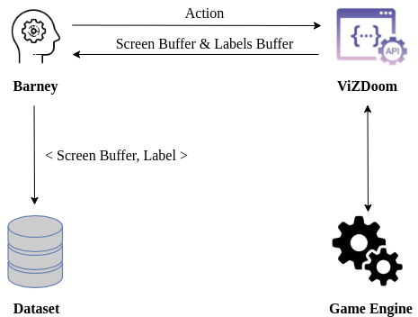
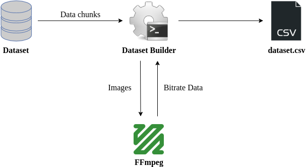
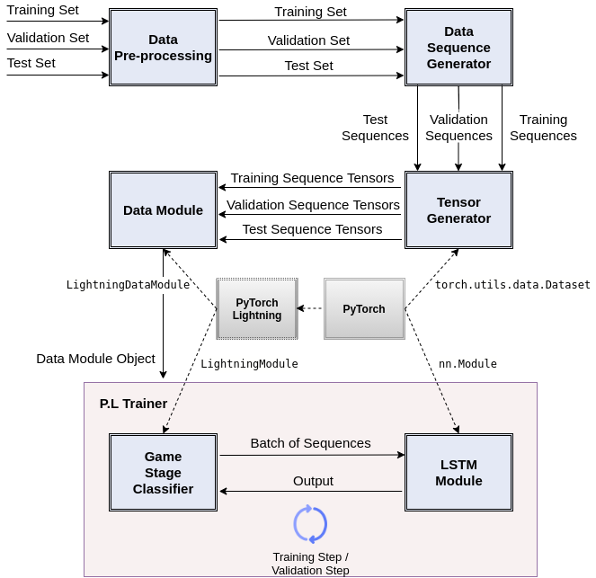

# Barney

Barney is an enhanced implementation of Arnold, the Deep Reinforcement Learning agent presented in [*Playing FPS Games with Deep Reinforcement Learning*](https://arxiv.org/abs/1609.05521), and that won the [*ViZDoom AI Competition - 2017*](http://vizdoom.cs.put.edu.pl/competition-cig-2017).

Barney is differentiated from Arnold in terms of automated gameplay dataset generation and analysis capabilities. It was mainly developed to anayze the correlation between game stages and stream bitrate.

<p align="center">
  
</p>

#### This Repository Contains:
- The source code to train DOOM agents
- A package with 17 selected maps that can be used for training and evaluation
- 5 pretrained models that you can visualize and play against, including the ones that won the ViZDoom competition
- The script *dataset_builder* to build a dataset from the data chunks generated during an episode with the agent
- The script *dataset_analyzer* to analyze a dataset built by the script *dataset_builder*
- *model_builder* to create a Deep Learning model to classify game stages based on stream bitrate

#### Repository Structure

    .
    ├── pretrained                    # Examples of pretrained models
    ├── resources
        ├── freedoom2.wad             # DOOM resources file (containing all textures)
        ├── gameplay.gif              # Demonstration for a gameplay
        └── scenarios                 # Folder containing all scenarios
            ├── full_deathmatch.wad   # Scenario containing all deathmatch maps
            ├── health_gathering.wad  # Simple test scenario
            └── ...
    ├── src                           # Source files
        ├── doom                      # Game interaction / API / scenarios
        ├── model                     # DQN / DRQN implementations
        ├── dataset_util
            ├── dataset_builder.py    # Script to build a dataset
            └── dataset_analyzer.py   # Script to analyze dataset
        └── trainer                   # Folder containing training scripts
    ├── barney.py                     # Main file
    └── README.md

## Installation and Dependencies

Barney was tested successfully on Mac OS and Linux distributions.

Dependencies for manipulating the Deep Reinforcement Learning model to train an agent etc.:
- Python >= 3.5
- NumPy
- OpenCV
- PyTorch
- ViZDoom

Extra dependencies for the dataset generation capability:
- plotbitrate

Extra dependencies for creating a Deep Learning model for game stage classification:
- PyTorch Lightning >= 1.2.6 for automating the model training process
- tqdm for better process control
- Pandas and Seaborn for data analysis
- Scikit-learn


Follow the instructions on https://github.com/mwydmuch/ViZDoom to install ViZDoom. Be sure that you can import ViZDoom in Python from any directory. To do so, you can either install the library with `pip`, or compile it, then move it to the `site-packages` directory of your Python installation, as explained here: https://github.com/mwydmuch/ViZDoom/blob/master/doc/Quickstart.md.

`plotbitrate` is a script for plotting the bitrate of an audio or video stream over time. You can simply install it by:
```bash
pip install plotbitrate
```

## Train a model

There are many parameters you can tune to train a model.


```bash
python arnold.py

## General parameters about the game
--freedoom "true"                # use freedoom resources
--height 60                      # screen height
--width 108                      # screen width
--gray "false"                   # use grayscale screen
--use_screen_buffer "true"       # use the screen buffer (what the player sees)
--use_depth_buffer "false"       # use the depth buffer
--labels_mapping ""              # use extra feature maps for specific objects
--game_features "target,enemy"   # game features prediction (auxiliary tasks)
--render_hud "false"             # render the HUD (status bar in the bottom of the screen)
--render_crosshair "true"        # render crosshair (targeting aid in the center of the screen)
--render_weapon "true"           # render weapon
--hist_size 4                    # history size
--frame_skip 4                   # frame skip (1 = keep every frame)

## Agent allowed actions
--action_combinations "attack+move_lr;turn_lr;move_fb"  # agent allowed actions
--freelook "false"               # allow the agent to look up and down
--speed "on"                     # make the agent run
--crouch "off"                   # make the agent crouch

## Training parameters
--batch_size 32                  # batch size
--replay_memory_size 1000000     # maximum number of frames in the replay memory
--start_decay 0                  # epsilon decay iteration start
--stop_decay 1000000             # epsilon decay iteration end
--final_decay 0.1                # final epsilon value
--gamma 0.99                     # discount factor gamma
--dueling_network "false"        # use a dueling architecture
--clip_delta 1.0                 # clip the delta loss
--update_frequency 4             # DQN update frequency
--dropout 0.5                    # dropout on CNN output layer
--optimizer "rmsprop,lr=0.0002"  # network optimizer

## Network architecture
--network_type "dqn_rnn"         # network type (dqn_ff / dqn_rnn)
--recurrence "lstm"              # recurrent network type (rnn / gru / lstm)
--n_rec_layers 1                 # number of layers in the recurrent network
--n_rec_updates 5                # number of updates by sample
--remember 1                     # remember all frames during evaluation
--use_bn "off"                   # use BatchNorm when processing the screen
--variable_dim "32"              # game variables embeddings dimension
--bucket_size "[10, 1]"          # bucket game variables (typically health / ammo)
--hidden_dim 512                 # hidden layers dimension

## Scenario parameters (these parameters will differ based on the scenario)
--scenario "deathmatch"          # scenario
--wad "full_deathmatch"          # WAD file (scenario file)
--map_ids_train "2,3,4,5"        # maps to train the model
--map_ids_test "6,7,8"           # maps to test the model
--n_bots 8                       # number of enemy bots
--randomize_textures "true"      # randomize walls / floors / ceils textures during training
--init_bots_health 20            # reduce initial life of enemy bots (helps a lot when using pistol)

## Various
--exp_name new_train             # experiment name
--dump_freq 200000               # periodically dump the model
--gpu_id -1                      # GPU ID (-1 to run on CPU)
```

Once your agent is trained, you can visualize it by running the same command, and using the following extra arguments:
```bash
--visualize 1                    # visualize the model (render the screen)
--evaluate 1                     # evaluate the agent
--manual_control 1               # manually make the agent turn about when it gets stuck
--reload PATH                    # path where the trained agent was saved
```

Here are some examples of training commands for 3 different scenarios:

#### Defend the Center

In this scenario, the agent is in the middle of a circular map. Monsters regularly appear on the sides and are walking towards the agent. The agent is given a pistol with limited ammo and must turn around and kill the monsters before reaching it. The following command trains a standard DQN, that should reach the optimal performance of 56 frags (the number of bullets in the pistol) in about 4 million steps:

```bash
python arnold.py --scenario defend_the_center --action_combinations "turn_lr+attack" --frame_skip 2
```

#### Health Gathering

In this scenario, the agent walks on lava and loses health points at each time step. The agent has to move and collect as many health packs as possible to survive. The objective is to survive the longest possible time:

```bash
python arnold.py --scenario health_gathering --action_combinations "move_fb;turn_lr" --frame_skip 5
```

This scenario is straightforward, and the model quickly reaches the maximum survival time of 2 minutes (35 * 120 = 4200 frames). Besides, the scenario provides a `supreme` mode, in which the map is more complicated and where the health packs are much harder to collect:

```bash
python arnold.py --scenario health_gathering --action_combinations "move_fb;turn_lr" --frame_skip 5 --supreme 1
```

In this scenario, the agent takes about 1.5 million steps to reach the maximum survival time (but often dies before the end).

#### Deathmatch

In this scenario, the agent is trained to fight against the built-in bots of the game. Here is a command to train the agent using game features prediction (as described in [1]) and a DRQN:

```bash
python arnold.py --scenario deathmatch --wad deathmatch_rockets --n_bots 8 \
--action_combinations "move_fb;move_lr;turn_lr;attack" --frame_skip 4 \
--game_features "enemy" --network_type dqn_rnn --recurrence lstm --n_rec_updates 5
```

## Pretrained Models

#### Defend the center / Health gathering

```bash
./run.sh defend_the_center
./run.sh health_gathering
```

#### Track 1 - Barney vs 10 built-in AI bots

```bash
./run.sh track1 --n_bots 10
```

#### Track 2 - Barney vs 10 built-in AI bots - Map 2

```bash
./run.sh track2 --n_bots 10 --map_id 2
```

#### Track 2 - 4 Barneys playing against each other - Map 3

```bash
./run.sh track2 --n_bots 0 --map_id 3 --n_agents 4
```

#### Shotgun - 4 Barneys playing against each other using SuperShotgun (extremely difficult to beat)
```bash
./run.sh shotgun --n_bots 0 --n_agents 4
```

#### Shotgun - 3 Barneys playing against each other + 1 human player (to play against the agent)
```bash
./run.sh shotgun --n_bots 0 --n_agents 3 --human_player 1
```

## Dataset Generation and Analysis Using Pretrained Models

In order to enable frame recording and labeling during gameplay of a pretrained agent, you need to call `--generate_dataset true` when initiating the model. The important thing to note here is that the number of agents should be set to 1 since only one agent is allowed to record frame-label pairs during a game (there is no restriction for the number of bots).

As an example, the following command initiates a game of one agent vs. 6 bots in Map 1, with frame-label recording:
```bash
./run.sh track1 --map_id 1 --n_bots 6 --n_agents 1 --generate_dataset true
```

The Directory *experiments* is created when an episode is initiated. Besides logs, dataset chunks are recorded into the relevant experiment folder in this directory.

Once having terminated an episode, the following command builds a dataset and creates insight about game stage - bitrate correlation for each experiment in the directory *experiments*:
```bash
./run.sh dataset_builder
```

The figures below illustrate the frame extraction, labeling, and dataset build processes.

Frame Extraction and Labeling            |  Dataset Build
:-------------------------:|:-------------------------:
  |  

## Deep Learning Model for Game Stage Classification

To train a model on a created dataset, you need to simply call `model_builder` with a path of the dataset as in the example below:
```bash
./run.sh model_builder ./experiments/map_id_1/experiment_xx/dataset/dataset.csv
```

Following figure illustrates the model design at a high level:

<p align="center">
  
</p>
